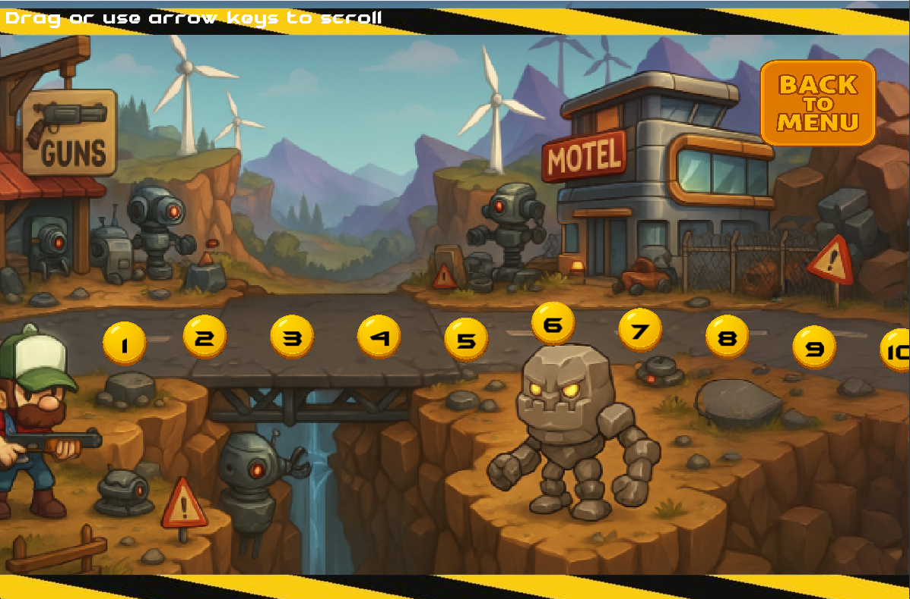
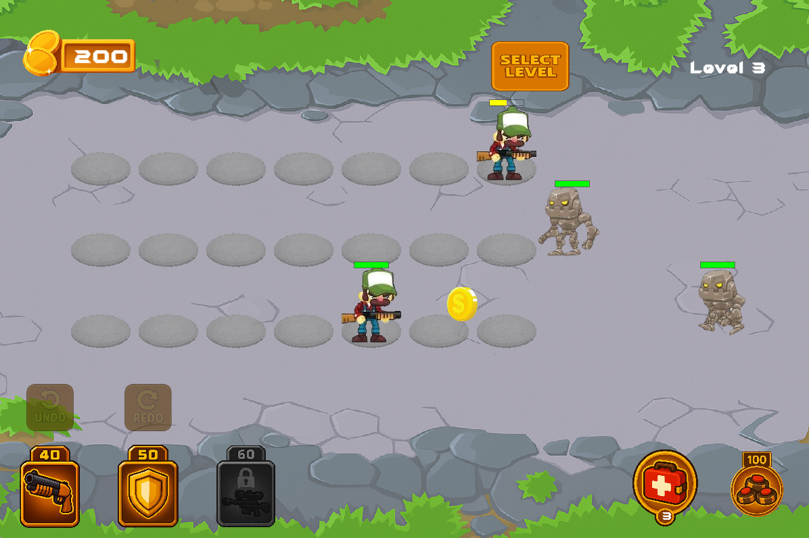
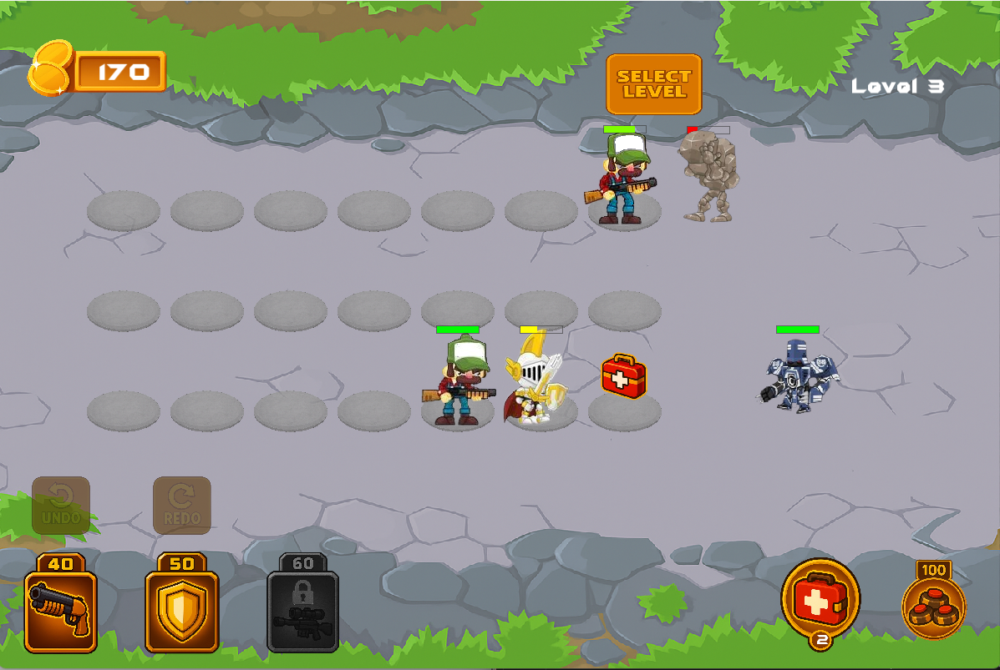

# 🎮 Special Forces vs Robots – C++ Tower Defense Game

A modern 2D **tower defense strategy game** where elite squad members fight off waves of invading robots.  
Built with **C++**, **SFML**, and **Box2D**, this project showcases advanced object-oriented design patterns, physics-based combat, dynamic wave generation, and modular architecture.

[](https://www.youtube.com/watch?v=u_lqAbsqPDs)  
🎥 **Click the image above to watch the full gameplay demo on YouTube.**

---

## 📋 Table of Contents

- [📦 Features](#-features)
- [🎮 Gameplay Screenshots](#-gameplay-screenshots)
- [🧠 Architecture Overview](#-architecture-overview)
- [🧱 Project Structure](#-project-structure)
- [🛠️ Build Instructions](#️-build-instructions)
- [🧪 Design Patterns Used](#-design-patterns-used)
- [📊 Algorithms & Systems](#-algorithms--systems)
- [🐞 Known Issues](#-known-issues)
- [📚 License & Credits](#-license--credits)

---

## 📦 Features

- ⚔️ **Squad Units**:
  - Heavy Gunner (rapid fire)
  - Sniper (long-range burst)
  - Shield Bearer (blocking and tanking)

- 🤖 **Enemy Robots**:
  - Basic melee, ranged firebots, stealth-speed attackers

- 🔥 **Combat Mechanics**:
  - Physics-based bullet/projectile system (Box2D)
  - Splash damage bombs and knockback effects

- 💸 **Economy System**:
  - Earn coins by defeating enemies
  - Spend to deploy or upgrade units

- 🎵 **Audio & UI**:
  - Centralized audio manager for music/sfx
  - Animated UI with sliders, buttons, and health bars

- 🚀 **Advanced Gameplay Features**:
  - Procedural wave generation
  - Undo/redo for unit placement (Command Pattern)
  - Full settings menu with volume controls
  - Victory & Game Over states with effects

---

## 🎮 Gameplay Screenshots

### 🧩 Main Menu  


### 🌍 Level Select  


### ⚔️ In-Game Combat 1  


### 🛡️ Combat & Healing  


---

## 🧠 Architecture Overview

This project is built with **modular, extensible architecture** using C++17. Key systems include:

### 🔁 Core Loop & State Machine
- `Game`, `GameManager`, and `StateMachine` manage the main loop, transitions, and lifecycle.

### 🧩 Component Managers
- `RobotManager`, `WaveManager`, `ProjectileManager`, `SquadMemberManager`, `AudioManager`, and more – all follow the **Singleton** pattern.

### 🎯 Entities
- `Robot`, `SquadMember`, `Projectile`, `Bomb`, `Collectible` — each entity class supports physics interaction, animation, and behavior logic.

### 🔧 Configurability
- Easily tune game mechanics using `.ini` files via `ConfigLoader`.

---

## 🧱 Project Structure

```
📁 oop2_project/
├── include/                  # Header files
├── src/                      # Source files
├── resources/
│   ├── textures/             # UI and game sprites
│   │   ├── Menu.png
│   │   ├── Levels.png
│   │   ├── Game.png
│   │   ├── Game2.png
│   │   ├── Game3.png
│   └── audio/                # Music and SFX
├── Entities/                 # Robots, SquadMembers, Collectibles
├── Managers/                 # Game logic managers
├── States/                   # GameState, Menu, Pause, etc.
├── UI/                       # HUD, Buttons, Sliders
├── Factories/                # Object creation
├── Commands/                 # Undo/Redo commands
├── Physics/                  # Box2D integration
├── Utils/                    # Helpers and Config loaders
├── main.cpp
├── CMakeLists.txt
└── README.md
```

---

## 🛠️ Build Instructions

### 🧰 Requirements

- **C++17** compiler
- **CMake 3.26+**
- **SFML 2.6**
- **Box2D**
  
> ⚠️ Ensure SFML and Box2D are correctly linked for your platform (Windows/Linux/macOS).

---

## 🧪 Design Patterns Used

| Pattern     | Purpose |
|-------------|---------|
| **Singleton**   | Managers: Resource, Audio, Settings, etc. |
| **Factory**     | For Robots, Projectiles, SquadMembers |
| **State**       | Game screen management (Menu, Pause, Play, etc.) |
| **Observer**    | EventSystem: decoupled communication |
| **Command**     | Undo/redo system for gameplay actions |

---

## 📊 Algorithms & Systems

- **Projectile Physics** using Box2D (trajectory, velocity, collision)
- **AI State Machine** for robot behavior (move, attack, react)
- **Wave Spawner** dynamically adjusts difficulty with level
- **Priority Targeting** (closest/weakest/first-in-range)
- **INI Config Loader** for tuning balance without recompilation
- **Event Queue Processing** with safe callback execution
- **RAII Memory** using `std::unique_ptr`, `std::shared_ptr`

---

## 🐞 Known Issues

- ✅ No known bugs — game tested and stable!

---

## 📚 License & Credits

> 🎓 **This project was developed as part of the OOP2 university course.**  
It is intended for educational purposes only.  
Commercial use or redistribution is not allowed without permission.

### 🙌 Special Thanks

- [SFML](https://www.sfml-dev.org/)
- [Box2D](https://box2d.org/)
- Our OOP2 instructor and classmates

---

## ✨ Authors

- **Musa Abu Alia** 
- **Ellen Habash**

---
